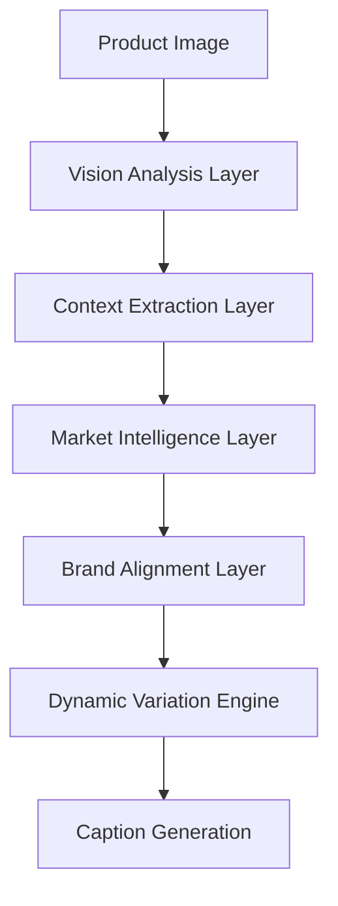

# Smart Captions Enhancement Plan
## Advanced AI-Powered Caption Generation System

### Current Limitations Analysis

#### **Problems Identified:**
1. **Static Template System** - Same templates generate identical results for same images
2. **Basic AI Analysis** - Simple JSON parsing without deep image understanding  
3. **No Contextual Variation** - Missing dynamic elements (time, trends, events)
4. **Limited Personalization** - No user preference learning or brand voice adaptation
5. **Repetitive Output** - No randomization or creative variation algorithms
6. **Missing Real-time Data** - No trend integration or market insights
7. **No Performance Learning** - No historical data analysis for optimization

---

## 🎯 **Enhanced System Architecture**

### **Phase 1: Multi-Layered AI Analysis System**

#### **1.1 Deep Image Analysis Pipeline**


**Components:**
- **Visual Intelligence**: Product details, composition, lighting, mood
- **Context Extraction**: Scene analysis, usage context, environment
- **Market Intelligence**: Category trends, competitor analysis, pricing signals
- **Brand Alignment**: Voice consistency, audience matching, tone adaptation
- **Variation Engine**: Dynamic content generation with entropy injection

#### **1.2 Enhanced Analysis Attributes**
```typescript
interface AdvancedProductAnalysis {
  // Core Product Intelligence
  productDetails: {
    name: string;
    category: string;
    subcategory: string;
    materials: string[];
    colors: string[];
    packaging: string;
    brandVisible: boolean;
    certifications: string[];
  };
  
  // Visual Analysis
  visualIntelligence: {
    composition: 'minimalist' | 'busy' | 'balanced';
    lighting: 'natural' | 'studio' | 'dramatic' | 'soft';
    mood: 'professional' | 'casual' | 'luxurious' | 'playful';
    backgroundType: 'white' | 'lifestyle' | 'textured' | 'gradient';
    angle: 'front' | 'side' | 'top' | '45degree';
    quality: 'premium' | 'standard' | 'budget';
  };
  
  // Market Intelligence
  marketContext: {
    category: string;
    competitorLevel: 'high' | 'medium' | 'low';
    seasonality: string[];
    pricePosition: 'budget' | 'mid' | 'premium' | 'luxury';
    marketTrends: string[];
    demographicAppeals: string[];
  };
  
  // Dynamic Context
  contextualFactors: {
    timeOfYear: string;
    currentTrends: string[];
    seasonalRelevance: string[];
    culturalContext: string[];
    economicContext: string;
  };
  
  // Performance Predictors
  performanceIndicators: {
    viralElements: string[];
    engagementTriggers: string[];
    conversionFactors: string[];
    riskFactors: string[];
    opportunityAreas: string[];
  };
}
```

### **Phase 2: Dynamic Caption Generation Engine**

#### **2.1 Multi-Layer Generation Strategy**
1. **Foundation Layer**: Core product messaging based on deep analysis
2. **Variation Layer**: Dynamic elements injection (trends, seasonality, events)
3. **Personalization Layer**: User/brand preference adaptation
4. **Optimization Layer**: Performance-based refinement
5. **Cultural Layer**: Regional and cultural adaptation

#### **2.2 Entropy Injection System**
```typescript
interface VariationParameters {
  // Content Variations
  openingStyles: string[];      // "Discover", "Meet", "Introducing", etc.
  narrativeAngles: string[];    // Problem-solution, lifestyle, testimonial
  emotionalHooks: string[];     // FOMO, exclusivity, social proof
  callToActionStyles: string[]; // Direct, soft, question-based
  
  // Dynamic Elements
  seasonalModifiers: string[];  // Weather, holidays, events
  trendingKeywords: string[];   // Current viral terms
  culturalReferences: string[]; // Regional preferences
  timeBasedFactors: string[];   // Morning/evening optimization
  
  // Performance Boosters
  engagementTactics: string[];  // Questions, polls, user-generated content
  viralTriggers: string[];      // Controversy, surprise, humor
  conversionDrivers: string[];  // Urgency, scarcity, social proof
}
```

#### **2.3 Advanced Caption Templates**
- **Narrative-Based**: Story-driven content with beginning, middle, end
- **Problem-Solution**: Pain point identification + product solution
- **Social Proof**: User testimonials and community validation
- **Educational**: How-to, tips, industry insights
- **Entertainment**: Humor, memes, trending formats
- **Aspirational**: Lifestyle transformation and goals

### **Phase 3: Real-Time Intelligence Integration**

#### **3.1 Trend Analysis Engine**
```typescript
interface TrendIntelligence {
  // Social Media Trends
  platforms: {
    instagram: {
      hashtagTrends: string[];
      formatTrends: string[];
      contentStyles: string[];
    };
    tiktok: {
      soundTrends: string[];
      challengeTrends: string[];
      formatTrends: string[];
    };
    facebook: {
      engagementTypes: string[];
      contentFormats: string[];
      audienceBehavior: string[];
    };
  };
  
  // Market Trends
  industry: {
    emergingKeywords: string[];
    seasonalPeaks: string[];
    competitorStrategies: string[];
    pricingTrends: string[];
  };
  
  // Cultural Trends
  regional: {
    indonesia: {
      culturalEvents: string[];
      languagePreferences: string[];
      contentStyles: string[];
    };
  };
}
```

#### **3.2 Performance Learning System**
```typescript
interface PerformanceLearning {
  // Historical Performance
  captionPerformance: {
    topPerformers: CaptionResult[];
    underPerformers: CaptionResult[];
    patterns: {
      bestTimes: string[];
      bestFormats: CaptionFormat[];
      bestHashtags: string[];
      bestTones: string[];
    };
  };
  
  // User Behavior Learning
  userPreferences: {
    preferredTones: string[];
    successfulFormats: CaptionFormat[];
    brandVoiceEvolution: string[];
    audienceResponsePatterns: string[];
  };
  
  // Market Learning
  industryBenchmarks: {
    averageEngagement: number;
    topPerformingElements: string[];
    seasonalPatterns: string[];
    competitiveAdvantages: string[];
  };
}
```

### **Phase 4: Advanced Personalization System**

#### **4.1 Brand Voice Learning**
- **Voice Pattern Recognition**: Analyze user's successful captions
- **Tone Adaptation**: Gradual refinement based on performance
- **Audience Response Mapping**: Track what resonates with specific demographics
- **Brand Consistency Scoring**: Ensure voice alignment across campaigns

#### **4.2 User Preference Engine**
```typescript
interface UserProfile {
  // Business Profile
  businessType: 'umkm' | 'corporate' | 'personal' | 'agency';
  industry: string;
  targetMarkets: string[];
  brandPersonality: string[];
  
  // Performance History
  successfulCampaigns: {
    captions: string[];
    performanceScores: number[];
    engagementMetrics: any[];
  };
  
  // Preferences
  preferredStyles: string[];
  avoidedTopics: string[];
  customKeywords: string[];
  brandGuidelines: string[];
  
  // Learning Data
  clickPatterns: any[];
  generationHistory: any[];
  feedbackData: any[];
}
```

### **Phase 5: Enhanced User Experience**

#### **5.1 Advanced Frontend Features**
1. **Multi-Step Wizard**: Guided caption generation process
2. **Brand Voice Builder**: Tool to define and refine brand personality
3. **A/B Testing Interface**: Side-by-side comparison and testing
4. **Performance Dashboard**: Real-time analytics and insights
5. **Content Calendar**: Scheduling and campaign planning
6. **Competitor Analysis**: Market comparison and benchmarking

#### **5.2 Smart Recommendation Engine**
- **Optimal Posting Times**: AI-suggested scheduling
- **Content Mix Recommendations**: Platform-specific content strategies
- **Hashtag Optimization**: Dynamic hashtag suggestions based on trends
- **Audience Engagement Patterns**: Best practices for target demographics

---

## 🔧 **Implementation Roadmap**

### **Sprint 1: Foundation Enhancement (Week 1-2)**
- [ ] Implement multi-layered AI analysis system
- [ ] Create dynamic variation algorithms
- [ ] Build entropy injection mechanisms
- [ ] Add contextual factor integration

### **Sprint 2: Intelligence Systems (Week 3-4)**  
- [ ] Integrate real-time trend analysis
- [ ] Build performance learning algorithms
- [ ] Create user preference tracking
- [ ] Implement brand voice recognition

### **Sprint 3: Advanced Features (Week 5-6)**
- [ ] Build A/B testing framework
- [ ] Create competitor analysis tools
- [ ] Implement content scheduling system
- [ ] Add market insights dashboard

### **Sprint 4: User Experience (Week 7-8)**
- [ ] Design enhanced frontend interface
- [ ] Build multi-step generation wizard
- [ ] Create performance analytics dashboard
- [ ] Implement feedback collection system

---

## 🎮 **Enhanced User Flow**

### **New Generation Process:**
1. **Smart Upload**: AI pre-analysis with instant feedback
2. **Business Context Setup**: Industry, audience, brand voice configuration
3. **Campaign Goals**: Specific objectives (awareness, engagement, conversion)
4. **Market Intelligence**: Real-time trend and competitor insights
5. **Multi-Variant Generation**: 15+ unique variations per request
6. **Performance Prediction**: AI-powered success forecasting
7. **A/B Testing Setup**: Automatic test configuration
8. **Optimization Recommendations**: Post-generation improvement suggestions

### **Continuous Learning Features:**
- **Performance Feedback Loop**: Track actual campaign results
- **Brand Voice Evolution**: Adapt to successful patterns
- **Market Trend Integration**: Real-time trend incorporation
- **Competitive Intelligence**: Monitor and adapt to market changes

---

## 🔮 **Advanced AI Capabilities**

### **Gemini-Powered Enhancements:**
1. **Multi-Modal Analysis**: Image + text + context understanding
2. **Cultural Sensitivity**: Regional content adaptation
3. **Trend Prediction**: Future trend forecasting
4. **Sentiment Optimization**: Emotional response maximization
5. **Competition Analysis**: Market positioning insights

### **Machine Learning Components:**
- **Performance Prediction Models**: Success probability scoring
- **User Preference Learning**: Personalized recommendation algorithms
- **Content Optimization**: Continuous improvement based on results
- **Market Trend Detection**: Pattern recognition for emerging trends

---

## 📊 **Success Metrics**

### **Improvement Targets:**
- **Variation Quality**: 95% unique content for same product
- **Performance Accuracy**: 80%+ prediction accuracy
- **User Satisfaction**: 90%+ approval rating
- **Time Efficiency**: 50% faster content creation
- **ROI Improvement**: 30%+ better campaign performance

### **Key Performance Indicators:**
- Caption uniqueness score
- Performance prediction accuracy
- User engagement improvement
- Content generation speed
- Brand voice consistency
- Market trend alignment

---

## 🚀 **Technical Implementation Details**

### **Backend Enhancements:**
- Multiple Gemini model utilization (2.0-flash, 2.5-flash, 1.5-pro)
- Redis cache for performance optimization
- Background job processing for complex analysis
- Real-time API integrations for trend data
- Machine learning pipeline for performance prediction

### **Database Schema Extensions:**
- User preference tracking tables
- Performance metrics storage
- Brand voice learning data
- Market intelligence cache
- A/B testing results storage

### **Frontend Innovations:**
- Real-time generation progress with detailed stages
- Interactive brand voice builder
- Performance prediction visualization
- Competitive analysis dashboard
- Content calendar integration

This enhanced system will transform Smart Captions from a basic template generator to an intelligent, learning-based content creation platform that delivers unique, high-performing captions every time.