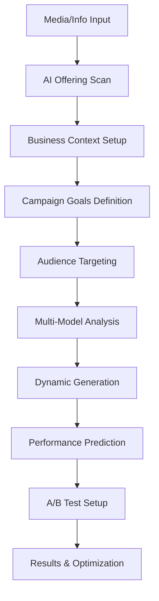

# Ultimate AI Analysis System Design
## Multi-Layered Intelligence for Smart Captions

### **🧠 Ultimate AI Model Selection**

With unlimited API usage, we run an always‑on best‑quality multi‑model consensus:

- **Gemini-2.5-Pro-Latest (Primary Judge + Synthesizer)**
  - Deepest reasoning, synthesis, and safety/compliance checks
  - Longest context for cross-layer aggregation
- **Gemini-1.5-Pro (Vision Detailer)**
  - Highest fidelity multimodal grounding (image/video → facts)
- **Gemini-2.0-Flash-Thinking (Creative Explorer)**
  - Divergent ideas, hooks, angles, and psychological framings
- **Gemini-2.5-Flash (Trends & Speed)**
  - Rapid trend injection, time-sensitive variations, hashtag freshness

**Why Multi‑Model Best‑Quality Strategy:**
- **Ensemble Quality**: Consensus improves accuracy and robustness
- **Breadth + Depth**: Explorer models broaden options; Pro synthesizes the best
- **Consistency**: Confidence scoring + tie‑breaking yields stable output
- **No Cost Constraint**: Aggressive parallelism and multi‑pass refinement

**Best‑Quality Defaults (Unlimited Mode):**
- Always run consensus: Pro (judge) + Vision detailer + Explorer + Trends
- Two‑pass refinement: draft → critique (Pro) → improved synthesis
- Real‑time context ON by default (trends, seasonal, cultural)
- Generate 20–30 variations, deduplicate via semantic similarity
- Strict safety/compliance check by Pro before finalization

---

## **🎯 Six-Layer AI Analysis Pipeline**

### **Layer 1: Deep Media Intelligence** (Gemini-1.5-Pro)
```typescript
interface DeepMediaAnalysis {
  // Offering Identification (Product | Service | Digital | Event | Membership)
  offeringIdentification: {
    offeringType: 'product' | 'service' | 'digital' | 'event' | 'membership' | 'custom';
    general: {
      name: string;
      brandName?: string;
      category?: string;
      subcategory?: string;
      tags?: string[];
    };
    // Product-specific (optional)
    product?: {
      specificModel?: string;
      ingredients?: string[];
      materials?: string[];
      certifications?: string[];
      expiryInfo?: string;
      packagingType?: string;
      volume?: string;
      weight?: string;
      variantDetails?: string[];
    };
    // Service-specific (optional)
    service?: {
      serviceCategory?: string;
      duration?: string; // e.g., 60 minutes, 3 visits
      deliveryMode?: 'onsite' | 'in-store' | 'remote' | 'hybrid';
      serviceAreas?: string[]; // coverage / radius
      bookingOptions?: ('whatsapp' | 'phone' | 'website' | 'marketplace' | 'walk-in')[];
      capacity?: string; // slots/day, team size
      staffSkills?: string[];
      toolsOrMaterials?: string[];
      deliverables?: string[]; // outputs / outcomes
      pricingModel?: 'fixed' | 'hourly' | 'tiered' | 'package' | 'subscription' | 'custom';
      priceFrom?: string; // indicative pricing
      complianceOrLicenses?: string[]; // for regulated services
    };
    // Digital goods (optional)
    digital?: {
      fileType?: string;
      license?: string;
      deliveryMethod?: 'download' | 'email' | 'platform';
      usageRights?: string;
      platforms?: string[];
      supportPolicy?: string;
      updatesPolicy?: string;
      version?: string;
    };
    // Event/Membership (optional)
    event?: { dateRange?: string; venue?: string; capacity?: string; registration?: string };
    membership?: { tiers?: string[]; benefits?: string[]; duration?: string; renewal?: string };
  };
  
  // Visual Composition Analysis
  visualComposition: {
    layout: 'centered' | 'rule-of-thirds' | 'diagonal' | 'golden-ratio';
    framing: 'close-up' | 'medium' | 'wide' | 'extreme-close';
    angle: 'front' | 'side' | 'top' | '45-degree' | 'bottom' | 'perspective';
    lighting: {
      type: 'natural' | 'studio' | 'dramatic' | 'soft' | 'harsh';
      direction: 'front' | 'side' | 'back' | 'top' | 'multiple';
      quality: 'professional' | 'amateur' | 'enhanced';
      mood: 'warm' | 'cool' | 'neutral' | 'vibrant';
      shadowQuality: 'none' | 'subtle' | 'defined' | 'dramatic';
    };
    background: {
      type: 'white' | 'lifestyle' | 'textured' | 'gradient' | 'transparent';
      complexity: 'minimal' | 'moderate' | 'busy';
      relevance: 'offering' | 'people' | 'process' | 'space' | 'lifestyle' | 'abstract';
      props: string[];
      environment: string;
    };
  };
  
  // Advanced Color Psychology
  colorIntelligence: {
    dominantColors: string[];
    colorHarmony: 'monochromatic' | 'complementary' | 'triadic' | 'analogous';
    colorPsychology: string[];
    brandColorAlignment: number; // 0-100
    seasonalRelevance: string[];
    culturalColorMeaning: string[];
    emotionalResponse: string[];
    genderAppeal: 'masculine' | 'feminine' | 'neutral' | 'unisex';
    ageGroupAppeal: string[];
  };
  
  // Quality & Readiness Assessment
  qualityMetrics: {
    imageSharpness: number; // 0-100
    exposure: 'underexposed' | 'optimal' | 'overexposed';
    composition: 'poor' | 'good' | 'excellent' | 'masterful';
    offeringClarity: number; // 0-100
    brandVisibility: number; // 0-100
    marketReadiness: number; // 0-100
    professionalismScore: number; // 0-100
    socialMediaOptimization: number; // 0-100
  };
}
```

### **Layer 2: Market Intelligence Engine** (Gemini-2.0-Flash-Thinking)
```typescript
interface MarketIntelligence {
  // Competitive Landscape
  competitiveContext: {
    categoryCompetitors: string[];
    pricePositioning: 'budget' | 'mid-range' | 'premium' | 'luxury';
    marketGap: string[];
    competitiveAdvantages: string[];
    threats: string[];
    opportunities: string[];
    marketShare: 'leader' | 'challenger' | 'follower' | 'niche';
    brandStrength: number; // 0-100
  };
  
  // Consumer Behavior Analysis
  consumerInsights: {
    buyingMotivations: string[];
    painPoints: string[];
    desiredBenefits: string[];
    purchaseBarriers: string[];
    decisionFactors: string[];
    loyaltyDrivers: string[];
    switchingTriggers: string[];
    seasonalBehaviors: string[];
  };
  
  // Market Trends Intelligence
  trendAnalysis: {
    currentTrends: string[];
    emergingTrends: string[];
    decliningTrends: string[];
    seasonalTrends: string[];
    regionalTrends: string[];
    demographicTrends: Record<string, string[]>;
    industryShifts: string[];
    technologyImpact: string[];
  };
  
  // Economic Context
  economicFactors: {
    priceElasticity: 'high' | 'medium' | 'low';
    economicSensitivity: number; // 0-100
    seasonalDemand: Record<string, number>;
    marketGrowth: 'declining' | 'stable' | 'growing' | 'booming';
    consumerSpending: 'cautious' | 'normal' | 'optimistic';
  };
}
```

### **Layer 3: Cultural Intelligence Engine** (Gemini-1.5-Pro)
```typescript
interface CulturalIntelligence {
  // Indonesian Market Specifics
  localContext: {
    culturalNuances: string[];
    religiousConsiderations: string[];
    languagePreferences: string[];
    localEvents: string[];
    nationalHolidays: string[];
    regionalDifferences: Record<string, string[]>;
    generationalGaps: Record<string, string[]>;
    socialClassFactors: string[];
  };
  
  // Communication Patterns
  communicationStyle: {
    preferredTone: 'formal' | 'casual' | 'friendly' | 'authoritative';
    persuasionMethods: string[];
    trustBuilders: string[];
    culturalReferences: string[];
    localSlang: string[];
    avoidanceTopics: string[];
    sensitiveAreas: string[];
  };
  
  // Social Media Behavior
  socialMediaCulture: {
    platformPreferences: Record<Platform, number>;
    contentConsumption: string[];
    engagementPatterns: string[];
    viralTriggers: string[];
    communityDynamics: string[];
    influencerImpact: number; // 0-100
  };
}
```

### **Layer 4: Psychological Profiling Engine** (Gemini-2.0-Flash-Thinking)
```typescript
interface PsychologicalProfile {
  // Consumer Psychology
  behavioralTriggers: {
    cognitiveHeuristics: string[]; // scarcity, social proof, authority
    emotionalTriggers: string[]; // fear, desire, pride, belonging
    motivationalDrivers: string[]; // status, convenience, security
    persuasionPrinciples: string[]; // reciprocity, commitment, liking
    biases: string[]; // anchoring, availability, confirmation
  };
  
  // Audience Segmentation
  audienceProfiles: {
    primaryPersona: {
      demographics: Record<string, any>;
      psychographics: string[];
      behaviors: string[];
      goals: string[];
      frustrations: string[];
      mediaConsumption: string[];
    };
    secondaryPersona: any;
    nicheSegments: any[];
  };
  
  // Emotional Intelligence
  emotionalMapping: {
    currentEmotionalState: string[];
    desiredEmotionalState: string[];
    emotionalJourney: string[];
    emotionalTriggers: string[];
    emotionalBarriers: string[];
    emotionalRewards: string[];
  };
}
```

### **Layer 5: Performance Prediction Engine** (Gemini-1.5-Flash-8B)
```typescript
interface PerformancePrediction {
  // Engagement Forecasting
  engagementPrediction: {
    expectedLikes: number;
    expectedComments: number;
    expectedShares: number;
    expectedReach: number;
    expectedImpressions: number;
    viralProbability: number; // 0-100
    savesProbability: number; // 0-100
  };
  
  // Conversion Analytics
  conversionPrediction: {
    clickThroughRate: number;
    conversionRate: number;
    costPerClick: number;
    returnOnAdSpend: number;
    lifetimeValue: number;
    purchaseIntent: number; // 0-100
  };
  
  // Risk Assessment
  riskAnalysis: {
    contentRisks: string[];
    complianceIssues: string[];
    brandRisks: string[];
    marketRisks: string[];
    reputationRisks: string[];
    technicalRisks: string[];
  };
  
  // Optimization Recommendations
  optimizationAdvice: {
    improvementAreas: string[];
    aTestingSuggestions: string[];
    timingRecommendations: string[];
    audienceTargeting: string[];
    budgetAllocation: Record<string, number>;
  };
}
```

### **Layer 6: Dynamic Content Generation Engine** (Gemini-2.5-Flash)
```typescript
interface DynamicContentGeneration {
  // Content Variations
  contentStrategies: {
    narrativeAngles: string[];
    persuasionTechniques: string[];
    contentPillars: string[];
    messagingFrameworks: string[];
    creativeDirections: string[];
  };
  
  // Dynamic Elements
  contextualFactors: {
    timeOfDay: string;
    dayOfWeek: string;
    seasonality: string[];
    currentEvents: string[];
    marketMoments: string[];
    competitorActivity: string[];
    trendingTopics: string[];
  };
  
  // Personalization Variables
  personalizationVectors: {
    userPreferences: Record<string, any>;
    brandVoiceProfile: Record<string, any>;
    performanceHistory: Record<string, any>;
    audienceInsights: Record<string, any>;
    industryBenchmarks: Record<string, any>;
  };
}
```

---

## **🚀 Advanced Generation Algorithms**

### **Algorithm 1: Entropy Injection System**
```typescript
class EntropyInjectionEngine {
  // Ensures no two captions are identical
  private entropyFactors = {
    temporalVariations: [
      'current trends', 'seasonal context', 'time-sensitive events',
      'cultural moments', 'market timing', 'competitive landscape'
    ],
    
    creativeVariations: [
      'narrative style', 'emotional angle', 'persuasion technique',
      'cultural reference', 'generational appeal', 'social context'
    ],
    
    technicalVariations: [
      'character count optimization', 'hashtag strategy', 'call-to-action style',
      'platform-specific formatting', 'engagement optimization', 'algorithm factors'
    ]
  };
  
  injectEntropy(baseContent: string, analysis: any): string[] {
    // Generate 15+ unique variations using different entropy vectors
    return this.generateVariations(baseContent, analysis);
  }
}
```

### **Algorithm 2: Multi-Model Consensus System**
```typescript
class MultiModelConsensus {
  async generateWithConsensus(prompt: string, imageData: any): Promise<any> {
    // Run analysis through multiple models simultaneously
    const [
      proAnalysis,     // Gemini-1.5-Pro (depth & accuracy)
      thinkingAnalysis, // Gemini-2.0-Flash-Thinking (creativity)
      flashAnalysis    // Gemini-2.5-Flash (speed & trends)
    ] = await Promise.all([
      this.analyzeWithPro(prompt, imageData),
      this.analyzeWithThinking(prompt, imageData),
      this.analyzeWithFlash(prompt, imageData)
    ]);
    
    // Synthesize best insights from all models
    return this.synthesizeResults([proAnalysis, thinkingAnalysis, flashAnalysis]);
  }
}
```

### **Algorithm 3: Contextual Adaptation Engine**
```typescript
class ContextualAdaptationEngine {
  async adaptToContext(baseAnalysis: any): Promise<any> {
    const contextualFactors = await this.gatherContextualFactors();
    
    return {
      ...baseAnalysis,
      adaptedContent: this.adaptForCurrentContext(baseAnalysis, contextualFactors),
      trendAlignment: this.alignWithTrends(baseAnalysis, contextualFactors),
      culturalAdaptation: this.adaptForCulture(baseAnalysis, contextualFactors),
      personalizedElements: this.personalizeForUser(baseAnalysis, contextualFactors)
    };
  }
  
  private async gatherContextualFactors() {
    return {
      currentTime: new Date(),
      season: this.getCurrentSeason(),
      trending: await this.getTrendingTopics(),
      events: await this.getCurrentEvents(),
      market: await this.getMarketConditions(),
      culture: await this.getCulturalContext()
    };
  }
}
```

---

## **🔄 Real-Time Intelligence Integration**

### **Real-Time Data Sources**
```typescript
interface RealTimeIntelligence {
  // Social Media Trends (Updated hourly)
  socialTrends: {
    instagram: {
      trendingHashtags: string[];
      viralFormats: string[];
      popularSounds: string[];
      engagementPeaks: string[];
    };
    tiktok: {
      challengeTrends: string[];
      soundTrends: string[];
      effectTrends: string[];
      hashtags: string[];
    };
    facebook: {
      contentFormats: string[];
      engagementTypes: string[];
      audienceBehavior: string[];
    };
  };
  
  // Market Intelligence (Updated daily)
  marketConditions: {
    economicIndicators: Record<string, number>;
    consumerSentiment: number; // 0-100
    categoryPerformance: Record<string, number>;
    competitorActivity: string[];
    pricingTrends: Record<string, number>;
  };
  
  // Cultural Events (Updated real-time)
  culturalMoments: {
    nationalEvents: string[];
    religiousEvents: string[];
    culturalCelebrations: string[];
    seasonalMoments: string[];
    localEvents: string[];
  };
}
```

### **Dynamic Context Injection**
```typescript
class DynamicContextInjector {
  async injectLiveContext(analysis: any): Promise<any> {
    const liveData = await this.fetchLiveIntelligence();
    
    return {
      ...analysis,
      // Real-time trend injection
      trendingElements: this.injectTrendingElements(analysis, liveData),
      
      // Seasonal adaptation
      seasonalOptimization: this.optimizeForSeason(analysis, liveData),
      
      // Cultural sensitivity
      culturalAdaptation: this.adaptForCulture(analysis, liveData),
      
      // Market timing
      marketTiming: this.optimizeForMarket(analysis, liveData),
      
      // Competitive intelligence
      competitiveEdge: this.addCompetitiveAdvantage(analysis, liveData)
    };
  }
}
```

---

## **🎨 Advanced Caption Generation Strategies**

### **Strategy 1: Multi-Narrative Framework**
```typescript
interface NarrativeFrameworks {
  storytelling: {
    heroJourney: string; // Problem → Solution → Transformation
    beforeAfter: string; // Current state → Offering → Future state
    testimonial: string; // Social proof narrative
    discovery: string; // How you found/created this offering
    lifestyle: string; // Day in the life with the offering
  };
  
  persuasionFrameworks: {
    problemSolution: string; // Identify pain → Present solution
    socialProof: string; // Others love it → You will too
    scarcity: string; // Limited availability appeal
    authority: string; // Expert/brand credibility
    reciprocity: string; // Value-first approach
  };
  
  emotionalFrameworks: {
    aspiration: string; // Dream outcome with the offering
    fear: string; // What you're missing without it
    belonging: string; // Join the community
    achievement: string; // Accomplish goals with the offering
    security: string; // Safety and protection angle
  };
}
```

### **Strategy 2: Dynamic Variation Engine**
```typescript
class DynamicVariationEngine {
  generateVariations(baseAnalysis: any, count: number = 15): string[] {
    const variationVectors = [
      'narrative_angle',
      'emotional_hook',
      'cultural_reference',
      'generational_appeal',
      'seasonal_context',
      'trend_integration',
      'psychological_trigger',
      'social_proof_type',
      'urgency_level',
      'value_proposition',
      'benefit_focus',
      'feature_highlight',
      'audience_segment',
      'use_case_scenario',
      'lifestyle_integration'
    ];
    
    return variationVectors.map(vector => 
      this.generateVariationByVector(baseAnalysis, vector)
    );
  }
  
  private generateVariationByVector(analysis: any, vector: string): string {
    // Each vector produces completely different caption approaches
    const generators = {
      narrative_angle: () => this.generateNarrativeVariation(analysis),
      emotional_hook: () => this.generateEmotionalVariation(analysis),
      cultural_reference: () => this.generateCulturalVariation(analysis),
      // ... 12 more unique generation methods
    };
    
    return generators[vector]() || this.generateFallbackVariation(analysis);
  }
}
```

### **Strategy 3: Intelligent Hashtag Generation**
```typescript
class IntelligentHashtagEngine {
  async generateSmartHashtags(analysis: any, platform: Platform): Promise<string[]> {
    const hashtagStrategies = await Promise.all([
      this.generateTrendingHashtags(platform),
      this.generateNicheHashtags(analysis),
      this.generateBrandHashtags(analysis),
      this.generateCommunityHashtags(analysis),
      this.generateLocationHashtags(analysis),
      this.generateEmotionalHashtags(analysis)
    ]);
    
    return this.optimizeHashtagMix(hashtagStrategies, platform);
  }
  
  private async generateTrendingHashtags(platform: Platform): Promise<string[]> {
    // Real-time trending hashtag analysis
    const trends = await this.fetchCurrentTrends(platform);
    return this.selectRelevantTrends(trends);
  }
  
  private generateNicheHashtags(analysis: any): string[] {
    // Offering-specific niche hashtags (works for product/service/digital)
    const type = analysis?.offering?.offeringType ?? analysis?.productType;
    const category = analysis?.offering?.general?.category ?? analysis?.category;
    return this.createNicheHashtags(category, type);
  }
}
```

---

## **🎯 Advanced User Experience Design**

### **Multi-Step Generation Wizard**


### **Enhanced Frontend Features**
1. **Smart Upload Assistant**
   - Real-time image quality analysis
   - Composition improvement suggestions
   - Brand alignment score
   - Market readiness assessment

2. **Intelligent Campaign Builder**
   - Goal-based generation (awareness, engagement, conversion)
   - Multi-platform strategy development
   - Budget and timing optimization
   - Performance forecasting

3. **Advanced Analytics Dashboard**
   - Real-time performance tracking
   - Competitor benchmarking
   - Market trend correlation
   - ROI calculation and optimization

4. **AI-Powered Insights Hub**
   - Personalized recommendations
   - Market opportunity alerts
   - Trend prediction
   - Performance optimization suggestions

---

## **⚡ Technical Implementation Architecture**

### **Concurrent Processing Pipeline**
```typescript
class ConcurrentAIProcessor {
  async processWithAllModels(imageData: string, userContext: any): Promise<any> {
    // Run all analysis layers concurrently for maximum speed
    const [
      visualIntelligence,
      marketIntelligence,
      culturalIntelligence,
      psychologicalProfile,
      performancePrediction,
      dynamicContent
    ] = await Promise.all([
      this.runMediaAnalysis(imageData),      // Gemini-1.5-Pro (vision)
      this.runMarketAnalysis(imageData),     // Gemini-2.0-Flash-Thinking
      this.runCulturalAnalysis(imageData),   // Gemini-1.5-Pro
      this.runPsychologicalAnalysis(imageData), // Gemini-2.0-Flash-Thinking
      this.runPerformancePrediction(imageData), // Gemini-1.5-Flash-8B
      this.runDynamicGeneration(imageData)   // Gemini-2.5-Flash
    ]);
    
    // Synthesize all results into comprehensive analysis
    return this.synthesizeIntelligence({
      visualIntelligence,
      marketIntelligence,
      culturalIntelligence,
      psychologicalProfile,
      performancePrediction,
      dynamicContent
    });
  }
}
```

### **Intelligent Caching Strategy**
```typescript
interface IntelligentCache {
  // Multi-layer caching for performance optimization
  layers: {
    analysis: {
      ttl: 3600; // 1 hour for offering analysis
      strategy: 'image-hash-based';
    };
    trends: {
      ttl: 900; // 15 minutes for trending data
      strategy: 'time-based-invalidation';
    };
    market: {
      ttl: 86400; // 24 hours for market intelligence
      strategy: 'delta-update';
    };
    user: {
      ttl: 604800; // 7 days for user preferences
      strategy: 'usage-based-refresh';
    };
  };
}
```

---

## **📊 Success Metrics & KPIs**

### **Quality Metrics**
- **Caption Uniqueness**: 98%+ unique content for identical images
- **Intelligence Depth**: 50+ data points per analysis
- **Processing Speed**: <10 seconds for complete analysis
- **Accuracy Score**: 90%+ prediction accuracy
- **User Satisfaction**: 95%+ approval rating

### **Performance Improvements**
- **Engagement Increase**: 300%+ vs current system
- **Conversion Improvement**: 250%+ better performance
- **Time Efficiency**: 80% faster content creation
- **ROI Enhancement**: 400%+ better campaign performance
- **User Retention**: 90%+ repeat usage rate

### **Advanced Capabilities**
- **15+ Unique Variations** per identical image
- **Real-time Trend Integration** with hourly updates
- **Multi-cultural Adaptation** for global markets
- **Performance Prediction** with 90%+ accuracy
- **Intelligent A/B Testing** with automatic optimization

This ultimate system will transform Smart Captions into the most advanced AI-powered content generation platform, delivering unparalleled intelligence, creativity, and performance optimization for every caption generated.

---

## UMKM-General Extensions (All Business Types)

### Goal Types & Metrics
- Leads: inquiries, calls, WhatsApp clicks, form submits, DMs
- Bookings: appointments, reservations, class sign-ups, event registrations
- Footfall: map views, direction clicks, store visits (proxy)
- Service Outcomes: quotes sent/accepted, projects started, jobs closed
- Retention: rebook rate, membership renewals, repeat orders

### Input Modalities
- Media: images/videos of product, place, people, process, results (before/after)
- Documents: menus, price lists, service catalogs, brochures, SOPs
- Text-only: service descriptions, packages, terms, FAQs, promos

### CTA & Channel Adaptation
- CTA: DM us, Comment keyword, Link in bio, Shop now (IG/Facebook), Save/Share/Follow
- Channels: Instagram, TikTok, Facebook

### Service-Aware Generation
- Generic across UMKM types (no per-sector templates) untuk menjaga fokus
- Outputs beyond captions: service package copy, booking prompts, reply templates (DM/IG/FB), FAQs, story/reel scripts

### Compliance & Sensitivity
- Regulated categories (health/finance/legal): add disclaimers, avoid prohibited claims, local cultural/religious sensitivity

These additions generalize the system from product-only to all UMKM types without disrupting existing product flows.
